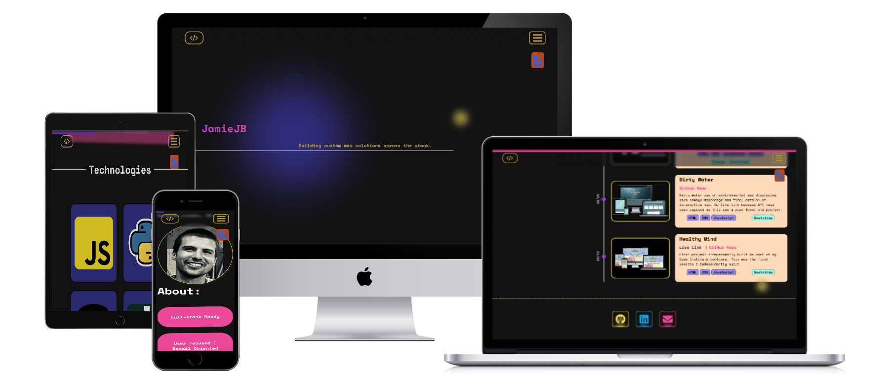
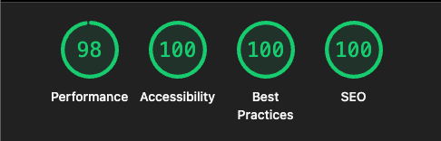

# Portfolio

[Link to deployed site](https://dev-jamie-jb.com/)

Welcome to my portfolio website.

I had a lot of fun building this and used it as an opportunity to continue building on the foundation I have, refining my skills, and expanding the tools and knowledge I can draw on.

To build this project I again chose React as my library / framework because it was a great opportunity to continue practicing working with it, deepening my understanding of React hooks and state management.

This project was particularly fun for me as an exercise in design. It was great getting my hands a bit dirtier with more advanced CSS (pseudo-elements, transitions, animations and keyframes), becoming more familiar with Tailwind CSS and playing around with [Motion](https://motion.dev/) for the first time.

Diving into new projects is always great for the unexpected obstacles the process inevitably throws up. This project gave me my first taste of working with GitHub CI / CD workflows, as well as buying a custom domain name and linking this with the GitHub pages deployed hosting. It's always exciting to encounter novel challenges and make new discoveries!

### CI / CD:

Being inexperienced with Vite / React apps, I didn't realise that - when it came time to deploying - there might be some issues. The standard configuration for vite deployment and running npm run deploy wouldn't work (I think likely because of the sheer amount of files / images in my project). The project was correctly being bundled into a dist folder but when it came to pushing that up to gh-pages branch, I was always getting the same error: 'The remote end hung up'. When this has happened to me in the past with GitHub my workaround has always been to simply chunk the files I am trying to push, however with 'npm run deploy' it is not possible to push in cumulative chunks.

This led me to discover and use [GitHub Actions](https://github.com/features/actions) for the first time (which was exciting!) to set-up an automated CI / CD workflow pipeline using a 'yml' file in my project. This enabled me to circumvent the issue (rooted in the step of pushing files locally to remote) because now GitHub Actions was taking care of the deployment steps remotely on GitHub (where the files were already stored!). This was an exciting discovery to me and I'm looking forward to exploring this tool further, what else can be leveraged and automated with GitHub actions.

I was familiar with this CI / CD concept through using [Heroku](https://www.heroku.com/students/). However, I didn't realise that this was something you could set-up internally on GitHub (happy days!).

### Setting up a Custom Domain:

This was also the first time I had bought and set-up a custom web domain and linked it to one of my deployed projects.

I used [IONOS](https://www.ionos.co.uk/?itc=WYLRLF90-TH53Y8-658T7N9&utm_source=google&utm_medium=cpc&utm_campaign=SBT-GB-BRA-BRAX---IONOS---&utm_term=ionos&matchtype=e&utm_content=IONOS&gclsrc=aw.ds&gad_source=1&gad_campaignid=15650323618&gbraid=0AAAAADA9BcXtCQ7Szrf8WZ7nXnT9YEeql&gclid=Cj0KCQjw3OjGBhDYARIsADd-uX6DiK4O1nfc-CYmdyuH50K1-JFQFQTNPX0sewyw9EtW-R0NAMzmGzMaAsLqEALw_wcB) to buy a custom '.com' domain as it was only £1 for the first year. It was interesting to learn about DNS records, DNS propogation, SSL certification, Apex vs Sub domains, and how to line all this up correctly with your website's host.

## Lighthouse Testing:

Lighthouse test results for the webpage.

It was also an enjoyable exercise to be mindful of accessibility while creating this website and I'm happy to see that emphasis reflected in the lighthouse results.

## Technologies:

- HTML5
- CSS3
- JavaScript
- [Motion](https://motion.dev/)
- [GitHub Actions](https://github.com/features/actions)
- [IONOS](https://www.ionos.co.uk/?itc=WYLRLF90-TH53Y8-658T7N9&utm_source=google&utm_medium=cpc&utm_campaign=SBT-GB-BRA-BRAX---IONOS---&utm_term=ionos&matchtype=e&utm_content=IONOS&gclsrc=aw.ds&gad_source=1&gad_campaignid=15650323618&gbraid=0AAAAADA9BcXtCQ7Szrf8WZ7nXnT9YEeql&gclid=Cj0KCQjw3OjGBhDYARIsADd-uX6DiK4O1nfc-CYmdyuH50K1-JFQFQTNPX0sewyw9EtW-R0NAMzmGzMaAsLqEALw_wcB)

## Frameworks:

- [React.js](https://react.dev/)
- [Tailwind CSS](https://tailwindcss.com/)
- [Vite](https://vite.dev/)

## Credits

Credit goes to my fellow code-institute coursemate [Paul Morgan](https://github.com/KernowPabloUK) and his [portfolio website](https://calculated-code.com/#footer) for giving me the inspiration for the flip-cards.

Credit goes to [Abdullah](https://abdullah-portfolio-dev.vercel.app/#tech-stack) for his beautifully styled buttons which I took inspiration from.
